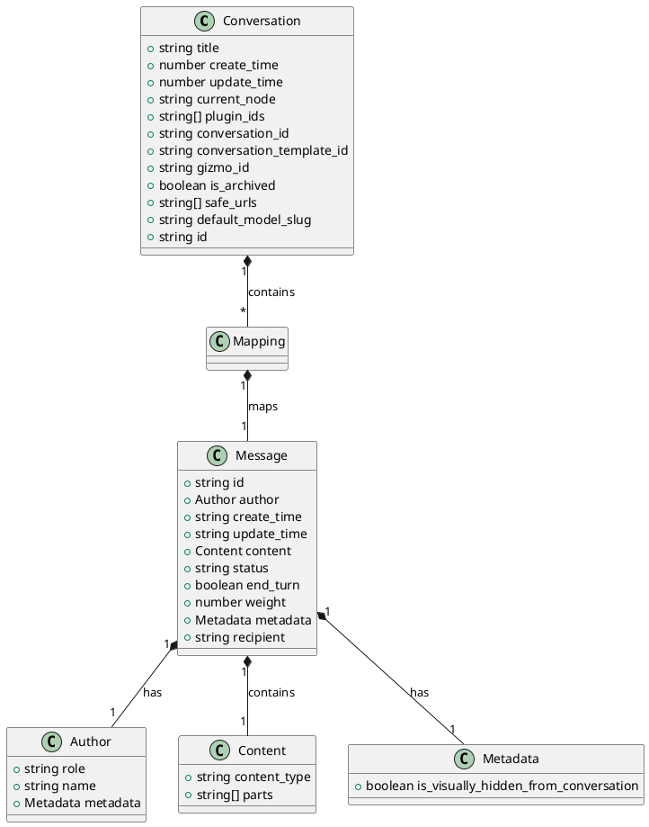

# Data Models

## Conversation Model

```plantuml
@startuml
class Conversation {
  +string title
  +number create_time
  +number update_time
  +string current_node
  +string[] plugin_ids
  +string conversation_id
  +string conversation_template_id
  +string gizmo_id
  +boolean is_archived
  +string[] safe_urls
  +string default_model_slug
  +string id
}

class Message {
  +string id
  +Author author
  +string create_time
  +string update_time
  +Content content
  +string status
  +boolean end_turn
  +number weight
  +Metadata metadata
  +string recipient
}

class Author {
  +string role
  +string name
  +Metadata metadata
}

class Content {
  +string content_type
  +string[] parts
}

class Metadata {
  +boolean is_visually_hidden_from_conversation
}

class Mapping {
}

Conversation "1" *-- "*" Mapping : contains
Mapping "1" *-- "1" Message : maps
Message "1" *-- "1" Author : has
Message "1" *-- "1" Content : contains
Message "1" *-- "1" Metadata : has
@enduml
```
